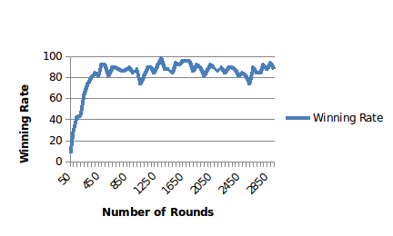
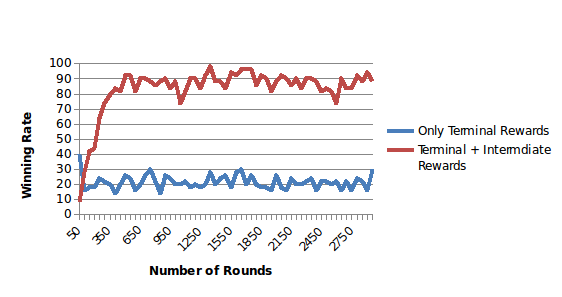

# Reinforcement Machine Learning

This is my reinforcement machine learning robot implementation for the Robocode framework.

> Robocode is an exciting, interactive environment designed by IBM, originally as a teaching aid in
> Java. However it has since become a popular tool for the exploration of topics in artificial
> intelligence (AI), including neural networks and reinforcement learning (RL). 

## Summary

- Developed a Java Robocode agent that implements Temporal Difference Reinforcement Learning
- Implemented a feed-forward Neural Network trained via Back Propagation algorithm, minimizing the need for state
space reduction, while improving generalization
- Adjusted learning parameters and exploration rates, increasing winning rate from 10% to 98% within 3000 trials

## Requirements

1. Implement Multi-layer perceptron and train it using the error-backpropagation algorithm
2. Reinforcement Learning using a Look-Up-Table (LUT), using it in Robocode.
3. Reinforcement Learning with Backpropagation

## Reinforcement Learning using a Look-Up-Table (LUT)

#### Learning Progress

Robot learns a lot initially, reaching 80% winning rate in 350 rounds. 
Total # of Round: 3000.
Epsilon: 0.2 (where e= 1.0 is 100% random)

#### Comparing Performance of On-Policy vs Off-Policy learning

I compare the difference between QLearning and SARSA, in both, the training stage (e=0.2), and the performance after that (e=0).

As expected, QLearning works better for robocode.
On-Policy: SARSA.
OFF-Policy: Q-Learning

#### Comparing Performance With and Without Intermediate Rewards

Using only terminal rewards works terribly with tasks like robocode.

#### Comparing Performance of Various Exploration Rates

Training Stage: 1000 rounds, for varies epsilon values.
Performance Stage: epsilon is then set to 0.
The graph shows the performance stage (e=0), using specific epsilon values at the training stage.
Very high or very low epsilon values do not yield the best results.
From those tested epsilon values, e=0.5 achieved the highest winning rate (99%).

